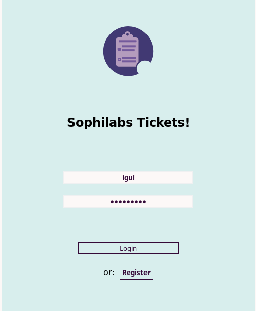
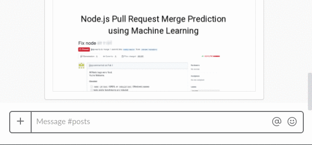

# Training Project

As an apprentice, once you complete the self learning process you will be assigned to work on a
Ticket System Project, which will give you a chance to apply your current knowledge and to continue learning
as well as to practice giving and receiving feedback with your Mentor. The Ticket System
specifications can be found online at [sophilabs training](https://github.com/sophilabs/training).
Your mentor will give you the actual requirements for the project and a deadline, which can be
anywhere from one to two weeks from now. This project is an excellent opportunity to practice before
facing real clients, handling deadlines, managing expectations, negotiating a real scope, and prioritizing.

## Requirements

The ticket system requirements are described in the sophilabs [training](https://github.com/sophilabs/training)
page.

## Activities

This section describes some activities you will complete during your training project.

### Kickoff

Your mentor will meet with you to present the project, explain the scope, and set the deadlines of the
project. We will create a gitlab repository for the project where you can commit your code. Make sure
you have access to the private company's [gitlab](https://git.sophilabs.io/). Please set up [gilp](https://sophilabs.co/blog/gulp-and-commit-hooks-gilp)
commit hooks for Python and for Javascript in order to ensure that your code complies with the
[language guidelines](/programming/README.md). You can download a sample gilp ready `gulpfile.js`
[here](https://github.com/sophilabs/gilp/blob/master/examples/full.js) and adapt it to your needs.

### Feature work

After the kickoff meeting, you should be ready to work on the project. This is the perfect time to
practice implementing our development process. You should follow a [git flow](http://nvie.com/posts/a-successful-git-branching-model/)
branching model development. In this project this means that whenever you make a new feature, you
should create a feature-specific branch for the work you are doing. Whenever you finish your work
you should create a [Merge Request](https://docs.gitlab.com/ee/gitlab-basics/add-merge-request.html)
so that every commit onto the master branch is reviewed by a teammate first. In the training project
your mentor will act as the reviewer following the [Code Review](https://sophilabs.co/playbook/#code-reviews)
Guidelines and give you feedback on your work.

### Demo

At the end of the project, we will ask you to demo your Ticket system for your mentor. Think of this
exercise as a product demo after the end of an SCRUM sprint where your mentor will act as a product owner.
This [article](https://www.atlantbh.com/blog/4-steps-successful-product-demo/) gives some ideas about
how to make your demo as effective as possible.

## Tips

* *Prioritize*: Mandatory Requirements vs Optional. Consider doing mandatory requirements first,
  and then focusing on the optional ones if you have time.
* *Organize*: Keep your work organized using a Trello Board, this will prevent you from getting stuck
  and help you to focus on the most important things.
* *Negotiate*: Any developer should be able to negotiate requirements if the scope is too big. Feel
  free to negotiate the deadlines and requirements. Hitting deadlines and negotiating scope are common
  software projects with a fixed timeline.
* *Ask*: If you get stuck, ask around for help. At sophilabs we have several ways to find help when needed.
  * Use the `/guru` slack command to find experts in a certain area. Try it in any channel
    
  * The specfic Slack channels [#developers](https://sophilabs.slack.com/messages/developers),
    [#python](https://sophilabs.slack.com/messages/python), or
    [#react](https://sophilabs.slack.com/messages/react) are also great places to look for help.
  * Ask around! We are a friendly bunch and someone will surely know or at least be able to point you
    in the right direction.
