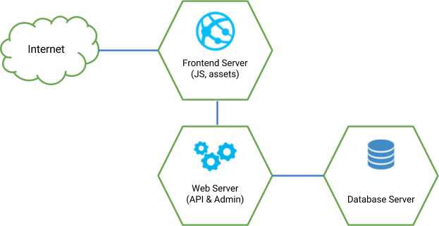

# Infrastructure

Defining a correct infrastructure for each project is important to assure
reliability, good performance and scalability in the application. Choosing
a wrong infrastructure can bring problems in a production environment.

Sophilabs recommends host your application in Amazon infrastructure and
use containerization.

## Amazon Web Services

[Amazon Web Services](https://aws.amazon.com/) provides a set of
scalable and reliable services that help you to host and monitor your
web applications. Amazon provides solutions to:

- Compute
  - [Amazon EC2](https://aws.amazon.com/)
  - [Amazon Lambda](https://aws.amazon.com/lambda/?hp=tile&so-exp=below)
- Storage
  - [Amazon S3](https://aws.amazon.com/s3/?hp=tile&so-exp=below)
- Database
  - [Amazon RDS](https://aws.amazon.com/rds/?hp=tile&so-exp=below)
  - [Amazon DynamoDB](https://aws.amazon.com/dynamodb/?hp=tile&so-exp=below)
  - [Amazon Aurora](https://aws.amazon.com/rds/aurora/?hp=tile&so-exp=below)
- Cache
  - [Amazon ElasticCache](https://aws.amazon.com/elasticache/?hp=tile&so-exp=below)
- Load Balancing
  - [Amazon Load Balancers](https://aws.amazon.com/elasticloadbalancing/?hp=tile&so-exp=below)
- Monitoring
  - [Amazon CloudWatch](https://aws.amazon.com/cloudwatch/?hp=tile&so-exp=below)

## Containerization

Using [Containerization](https://en.wikipedia.org/wiki/Operating-system-level_virtualization)
is important to isolate your web application server and database.

For example, a simple web application can use 3 containers.

- A Frontend Server, which hosts a javascript application and makes
  calls to a Backend Server to do any operation with the system.
- A Backend Server, which exposes an API for operating with the
  system.
- A Database Server to store persistent data, using PostgreSQL or another database engine of your
  choice.

### Docker

When we talk about containerization, the name [Docker](https://www.docker.com/) immediately comes to
mind.

Even though there are many containerization solutions, Docker is the most popular and is used in many
production environments. The development community has come to the consensus that Docker is the most
reliable containerization technology.

For these reasons, we recommend the usage of Docker to define the containers that your application
requires.

#### How to start

If you don't have experience working with docker or containers the following links will help you.

- Installation
  - Take a look at the [oficial installation guides](https://docs.docker.com/install/).
- Tutorials
  - Take a look at the [first](https://docs.docker.com/get-started/part1) and [second](https://docs.docker.com/get-started/part2/)
    parts of the oficial [get started tutorial](https://docs.docker.com/get-started/)
  - Take a look at [Prakhar Srivastav tutorial](https://docker-curriculum.com/).

#### Docker guidelines

There are several ways to define an application using Docker containers.
In this [link](https://docs.docker.com/develop/dev-best-practices/#where-and-how-to-persist-application-data)
you will find some patterns that docker team recommends to maintain small images with a fast building
time.

When you write a `Dockerfile`, you should consider the following [guidelines](https://docs.docker.com/develop/develop-images/dockerfile_best-practices/).

#### Docker compose

We recommend the usage of `docker-compose` to define and running Docker containers.
This tool is useful because allows you define multiple containers in a single `.yml` file. Moreover,
with `docker-compose` you have mechanisms to define environment variables and mount volumes in declarative
mode.

Installations guides, tutorials and best practices can be found in the following [link](https://docs.docker.com/compose/overview/).

#### Docker registry

[Docker registry](https://docs.docker.com/registry/) is a repository where you can store and share your
built images.
The docker registry allows you:

- Maintain traceability of the different versions you build.
- Share and store the images you build in a secure way.

### Kubernetes

In some cases your application might require having fault tolerance, dynamic scalability and zero downtime
between releases. In these cases, having a `Container Orchestator` is a good option.

Our recommendation for this task is using [Kubernetes](https://kubernetes.io/).

#### How to start

If you don't have experience working with kuberntes the following links will help you.

- Glosary
  - Before starting to work with kubernetes is important know the definitions of some concepts. The
    whole list of concepts can be found in the [Kubernetes documentation](https://kubernetes.io/docs/concepts/#kubernetes-objects).
    We recommend start reading the following concpets:
    - [Pod](https://kubernetes.io/docs/concepts/workloads/pods/pod-overview/)
    - [Service](https://kubernetes.io/docs/concepts/services-networking/service/)
    - [Namespace](https://kubernetes.io/docs/concepts/overview/working-with-objects/namespaces/)
    - [Deployment](https://kubernetes.io/docs/concepts/workloads/controllers/deployment/)
- Installation
  - Kubernetes was thougth to run inside a cluster for production environments. If you want execute your
    kubernetes cluster in a local environment we recomend to use [Minkube](https://kubernetes.io/docs/getting-started-guides/minikube/).
  - To interact with your cluster you will need the `kubectl`, the Kubernetes command line tool. To install
    and configure this tool review the following [link](https://kubernetes.io/docs/tasks/tools/install-kubectl/).
- Kubernetes tutorials
  - Take a look at [Kubernetes oficial tutorials](https://kubernetes.io/docs/tutorials/). We recommend
    the followings:
    - [Hello Minikube](https://kubernetes.io/docs/tutorials/hello-minikube/)
    - [Kuberntes basics](https://kubernetes.io/docs/tutorials/kubernetes-basics/)
    - [Stateful app](https://kubernetes.io/docs/tutorials/stateful-application/basic-stateful-set/)

#### Kubernetes best practices

Take a look at the following [link](https://kubernetes.io/docs/concepts/configuration/overview/) to
know the best pratices that Kubernetes team recommends.

#### Helm

We strongly recommend the usage of the tool [helm](https://helm.sh/).

This tool helps you in the definition of the components that you need. Using helm you have facilities
to define templates with your Kubernetes objects using variables. The variables are substituted with
the content of a `.yml` file when you upgrade a cluster. This feature allows you have a single template
for all the environments.

#### Kubernetes operations (kops)

For development environment you can host your cluster in a virtual machine using Minikube. However,
for production environments you should host your cluster using Amazon, Google Cloud or DigitalOcean
for example.

The comamnd line tool kops allows you interact with the infraestructure
in a esay way. You only need to define it in a config file.

For installation instructions and first steps with the tool visit the following [link](https://github.com/kubernetes/kops).

## Domain Names

We suggest using [Domize](https://domize.com/) to see what's available.
Use [DNSimple](https://dnsimple.com/) to buy and maintain domain names
if a client hasn't registered a domain name yet.

## SSL Certificates

Buy a wildcard certificate from [DNSimple](https://dnsimple.com/ssl-certificates).
The wildcard (\*) lets you use the same certificate on www., staging., api.,
and any other future subdomains. SSL and DNS are tightly coupled. If we're doing any
work with SSL, we need to make sure we have access to make DNS changes,
such as adding a CNAME record. When working with a client that has a DNS
department, schedule time during off-peak hours in order to pair program
with their DNS personnel to ensure smooth sailing. We can accidentally
take down a site that is all SSL if this work isn't done methodically.